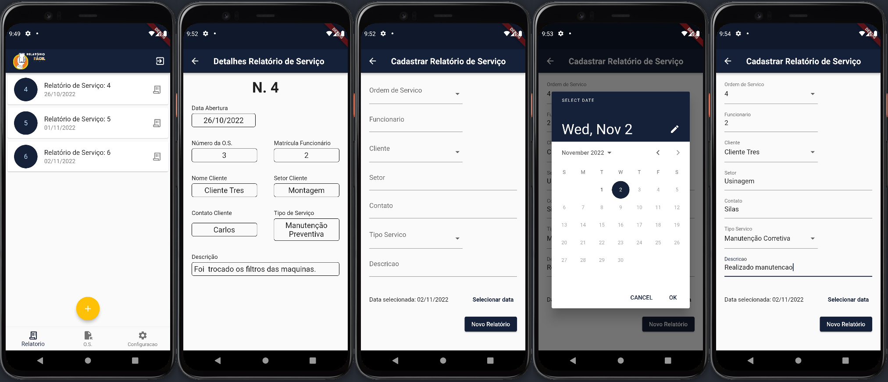
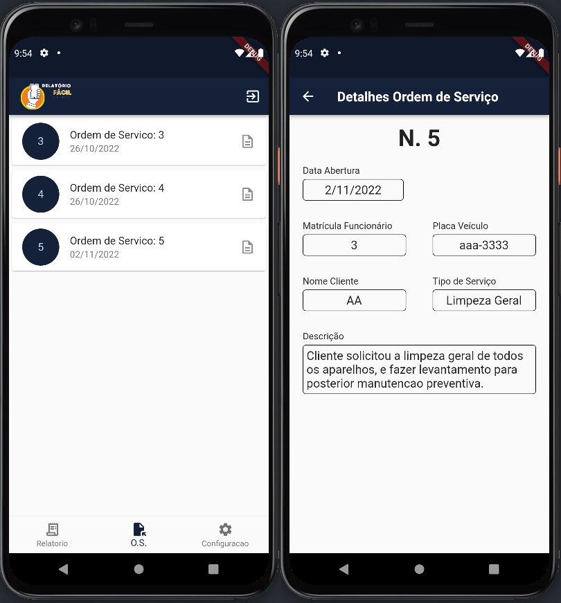
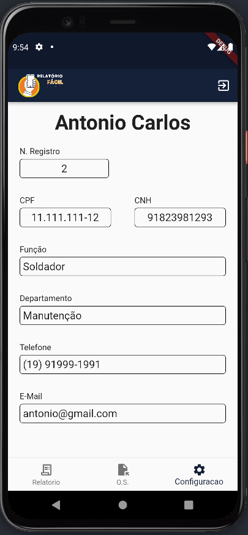

<p align="center">
  RELATÓRIO FÁCIL - App
</p>

<h2 align="center">Tópicos 📋</h2>

   <p>
   
   - [Sobre ](#sobre-)
   - [Layout ](#layout-)
   - [Como Usar ](#como-usar-)

   </p>

---

<h2 align="center">Sobre</h2>
   
<p>
    RELATÓRIO FÁCIL é um aplicativo para preenchimento de relatórios de serviço.<br>
    Foi desenvolvida como requisito para a matéria TG (Trabalho de Graduação) da FATEC Indaiatuba.<br>
    RELATÓRIO FÁCIL foi desenvolvido utilziando o framework Flutter.<br>
    Tecnologias utilizdas:<br>
    - Flutter<br>
    - Dart<br>
    <br>
    Alguma das características são:    
    - Formulário simples para o preenchimento dos relatórios de serviço;<br>
    - Os dados são salvos no banco de dados postgreSQL;<br>
    - Listagem de ordem de serviço e relatório de serviço;<br>
    - A listagem de ordem de serviço é uma integração com a aplicação web **[Relatório Fácil - Web](https://github.com/RamonTadeuGoncalves/EasyReport_Web)** que também faz parte do escopo do projeto.

</p>

---

<h2 align="center">Layout</h2>

<p align="center">
  Tela de Splash e de Login
</p>

   <p align="center">
      
   </p>
   <br>

<p align="center">
  Telas Relatório de Serviço
</p>

   <p align="center">
      
   </p>
   <br>

<p align="center">
  Telas Ordem de Serviço
</p>

   <p align="center">
      
   </p>
   <br>

<p align="center">
  Tela Detalhes do Funcionário
</p>

   <p align="center">
      
   </p>
   <br>

---

<h2 align="center">Como Usar</h2>

<h3>Requisitos</h3>
<p>
  - Flutter (https://flutter.dev/)<br>
  - Necessário Relatório Fácil - Web para gerenciamento do banco de dados e da API **[Relatório Fácil - Web](https://github.com/RamonTadeuGoncalves/EasyReport_Web)**.
</p>

```
- Clone esse repositório:
$ git clone https://github.com/RamonTadeuGoncalves/EasyReport_App.git

- Entre no diretório:
$ cd EasyReport_App

- Instale as dependências:
$ flutter pub get

- Inicie o app:
$ flutter run
```

<br>

---

> Esse projeto foi desenvolvido com muito esforço por mim **[Ramon Tadeu Gonçalves](https://www.linkedin.com/in/ramon-gon%C3%A7alves-a900bb190/)** <br>

---
